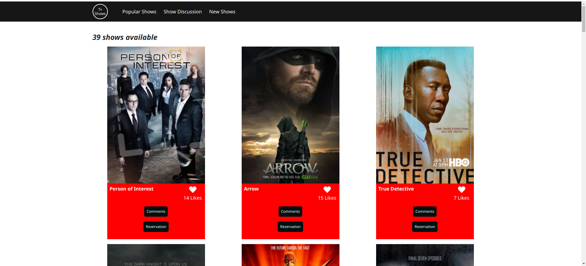
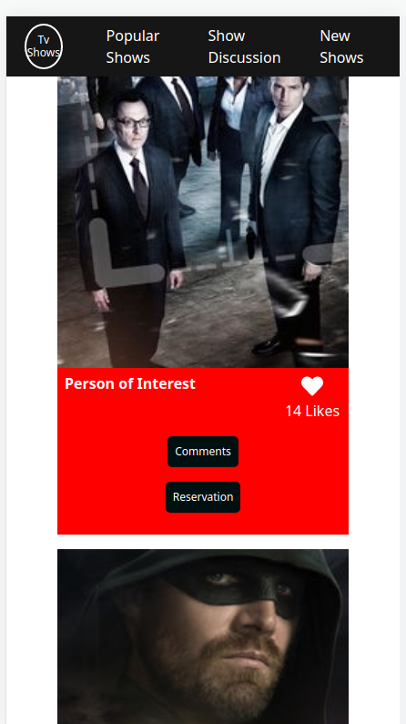

# TV Show App

TV Show App is a an application that displays details of TV Shows which are retrieved using API callls from [TV Maze API](https://www.tvmaze.com/api).
Users of the App can like a show or comment on the show and this user interactions are stored via API calls to [Microverse-Involvement-API](https://www.notion.so/Involvement-API-869e60b5ad104603aa6db59e08150270). Primarily involves making API calls and running functions asynchronously.

This project is done as part of Microverse.org curriculum.

## Project specifications

    APIs

          First, you need to find an API so you can base the development of the webapp around it. The API should allow you to:

            Get a list of items with a unique item id (or generate the unique id).
            For a given item, get detailed information about it.

          We recommend that you choose an API that doesn't need authentication. if you select an API that requires authentication, you should implement it on your own. Also, if you select an API that provides image resources your webapp will be more visual.

          Some example APIs are:

            Pokeapi: data about the Pokémon world.
            TVmaze API: data about TV series and movies.
            Meals DB: data about meals.

          You can find more APIs in this GitHub repo or in ProgrammableWeb. Some of the APIs require a token, some require authentication, and some others are just open.

            You will use our Involvement API to record the different user interactions (likes, comments and reservations).

    Interfaces

          You should build these interfaces:
                The home page.
                The comments popup.
                The reservations popup (only for the groups of 3 students).
          You should follow the layout of the wireframes provided. You should personalize the rest of the design including colors, typographies, spacings, etc.

          Home page
            When the page loads, the webapp retrieves data from:
              The selected API and shows the list of items on screen.
              The Involvement API to show the item likes.
            Remember that your page should make only 2 requests:
              One to the base API.
              And one to the Involvement API.
            When the user clicks on the Like button of an item, the interaction is recorded in the Involvement API and the screen is updated.
            When the user clicks on the "Comments" button, the Comments popup appears.
            When the user clicks on the "Reservations" button, the Reservations popup appears (only for the groups of 3 students).
            Home page header and navigation similar to the given mockup.
            Home page footer similar to the given mockup.

          Comments popup
            When the popup loads, the webapp retrieves data from:
              The selected API and shows details about the selected item.
              The Involvement API to show the item comments.
            When the user clicks on the "Comment" button, the data is recorded in the Involvement API and the screen is updated.

          Reservations popup (only for the groups of 3 students)
            When the popup loads, the webapp retrieves data from:
              The selected API and shows details about the selected item.
              The Involvement API to show the item reservations.
            When the user clicks on the "Reserve" button, the data is recorded in the Involvement API and the screen is updated.

          Counters We have counters in all the interfaces that show:

            The number of items (home).
            The number of comments (comments popup).
            The number of reservations (reservations popup) - only for the groups of 3 students.

          Even if the API gives you these numbers, you will create a specific function to calculate these numbers in each page. These count functions need to be covered with unit tests using Jest.

## Built With

- HTML
- Javascript
- API
- Aysnc Await
- Technologies used such as: Linters (Lighthouse, Webhint, Stylelint), Extensions (Live server, Prettier), Git, bootstrap, among others.

## Authors

👤 **Opeyemi Oyelesi**

- Github: [@Adedayoopeyemi](https://github.com/Adedayoopeyemi)
- Twitter: [@oyelesiopy](https://twitter.com/oyelesiopy)
- Linkedin: [linkedin](https://linkedin.com/opeyemioyelesi)

👤 **Nelsino Francisco**

- Github: [@nelsinofrancisco](https://github.com/nelsinofrancisco)
- Twitter: [@nelsino_s](https://twitter.com/nelsino_s)

## Usage

1. Navigate to your desired directory in your local machine using the terminal.

2. Clone repository by running `git clone git@github.com:AdedayoOpeyemi/todo-list.git` in your local terminal

3. Run the following command to install the needed dependencies

    `npm install`

4. Use the following commands to 
   `npm run start` to start the Webpack Dev server and serve the files from the dist directory
   `npm run build` to complile build all source files into the dist directory
   `npm run watch` to set webpack into watch mode so that the build is automatically run whenever changes are made to any of the source files.

## 🤝 Contributing

Contributions, issues, and feature requests are welcome!

Feel free to check the [issues page](https://github.com/AdedayoOpeyemi/js-capstone-api/issues).

## Show your support

Give a ⭐️ if you like this project!

## 📝 License

This project is [MIT](https://github.com/mariordgez/Project_1_HTML/blob/project-1-microverse/mit.md) licensed.
